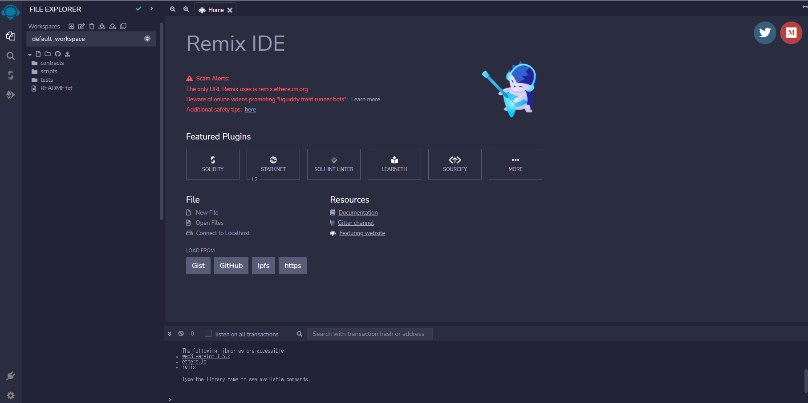
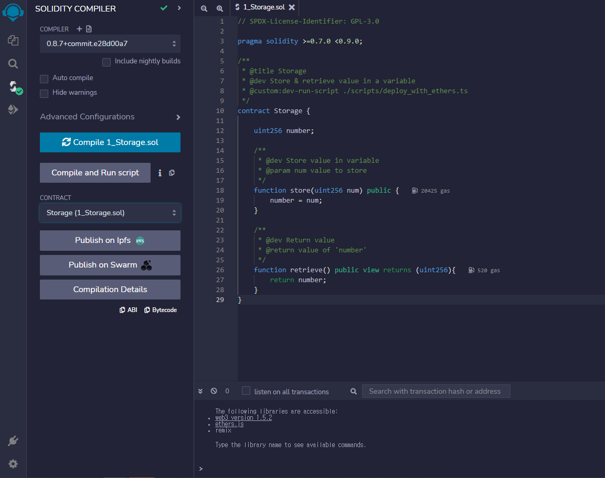
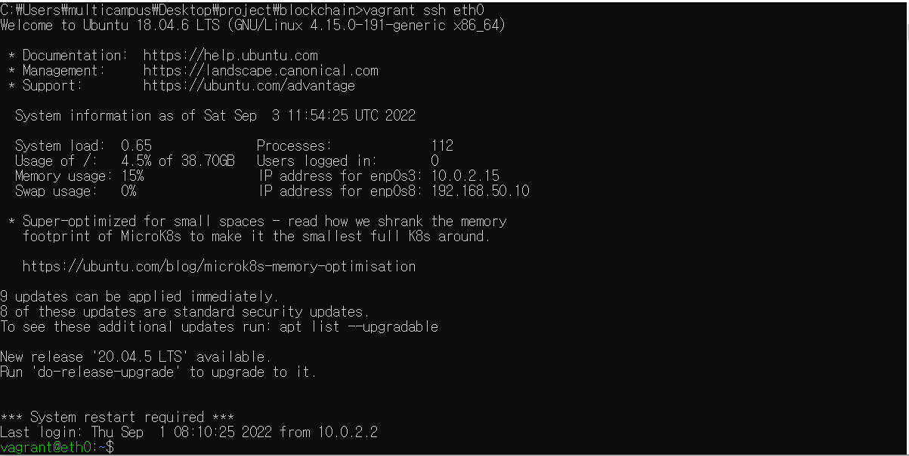
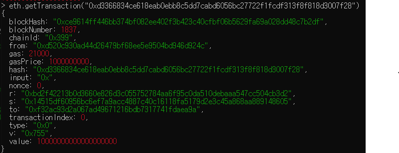

# BlockChainStudy

## SmartContract
* 불변, 한 번 배포되면 변경 불가
* 결정적, 실행된 결과가 모두 같음
* EVM 위에서 동작
* 탈중앙화된 Wolrd Computer 동일한 상태를 유지

## 배포와 호출 과정
* 배포

    스마트 컨트랙트 코드 작성 ->(컴파일,ABI 생성)-> 바이트 코드 ->(트랜잭션 생성)-> 컨트랙트 배포 트랜잭션 ->(트랜잭션 처리, CA생성)->  블록에 담김 ->(네트워크에 블록 전파)-> 블록 동기화

* 호출

    트랜잭션 생성(사용자 계정(EOA), 컨트랙트 계정(CA), ABI, 함수 주소, 매개변수) ->
    컨트랙트 호출 트랜잭션 생성 -> 처리후 블록에 담김 -> 네트워크 블록전파, 트랜잭션 실행 -> 블록 동기화

## 환경 설정

* Remix IDE(https://remix.ethereum.org)



## 스마트 컨트랙트 배포

* 테스트용 Storoge.sol 배포 


    컴파일 클릭 후 ABI,Bytecode 확인 가능

* 배포환경 설정

    DEPLOY & RUN TRANSACTIONS 에서 배포할 .sol 파일 선택 후 DEPLOY 클릭

    배포 후 CA 주소로 사용 할 수 있음


    
    
-----------
## 솔리디티
* 기본 구조
```
// SPDX-License-Identifier: GPL-3.0                  //  소스코드 라이선스 명시, 거의 수정x
pragma solidity >=0.7.0 <0.9.0;             // 사용하는 솔리디티 컴파일러 버전 명시

contract Storage {

    uint256 number;

    function store(uint256 num) public {
        number = num;
    }

    function retrieve() public view returns (uint256){
        return number;
    }
}
```

## Fund Raising 예시 구현
* https://docs.soliditylang.org/en/v0.7.0/ 공식문서 참고

* 일회성으로 동작하는 모금 컨트랙트
    
    * 일정 기간 동안만 이더를 지불하여 모금에 참여

    * 펀드, 현재 모금액, 모금액 수령 기능을 제공

* 상태 변수

    * uint duration  //유효시간

        * block.timestamp : 특수 전역 변수

    * address public beneficiary // address는 주소를 담는 변수 선언

    * uint public constant MINIMUM_AMOUT = 1e16; // 최소 모금액 0.01 ether

        * 이더리움 기본 단위 wei(10^18wei = 1ether)

* 함수 생성

    * fund()
    * currentCollection()
    * withdraw()

```
// SPDX-License-Identifier: GPL-3.0
pragma solidity >=0.7.0 <0.9.0;

contract FundRaising {
    uint public constant MINIMUM_AMOUT = 1e16;
    uint public fundRaisingCloses;
    address public beneficiary;

    address[] funders;

    constructor(uint _duration , address _beneficiary) {
        
        fundRaisingCloses = block.timestamp + _duration;
        beneficiary = _beneficiary;
    }

    function fund() public payable{
        if(msg.value >= MINIMUM_AMOUT){
            if(block.timestamp < fundRaisingCloses){
                address funder = msg.sender;
                funders.push(funder);
            }
        }
        //require(msg >= MINIMUM_AMOUNT, "error")
    }
    function currentCollection() public view returns(uint256) {
        return address(this).balance;
    }

    function withdraw() public payable {
        require(msg.sender == beneficiary);
        require(block.timestamp > fundRaisingCloses);

        payable(msg.sender).transfer(address(this).balance);
    }
}
```

------------

##  프라이빗 이더리움 네트워크 구축
### 가상 머신 구성
**vagrant 설정**

 ```
  > vagrant plugin install vagrant-scp
  ```

* vagrant 초기화
```
> vagrant init
```

* 해당 디렉토리에서 생성된 Vagrantfile 수정(실습환경 디렉토리 : C:/Users/multicampus/Desktop/project/blockchain)

```
# -*- mode: ruby -*-
  # vi: set ft=ruby :
  
  # All Vagrant configuration is done below. The "2" in Vagrant.configure
  # configures the configuration version (we support older styles for
  # backwards compatibility). Please don't change it unless you know what
  # you're doing.
  
  VAGRANT_API_VERSION = "2"
  
  vms = {
    'eth0' => '10',
    'eth1' => '11'
  }
  
  Vagrant.configure(VAGRANT_API_VERSION) do |config|
    config.vm.box = "ubuntu/bionic64"
    vms.each do |key, value|
      config.vm.define "#{key}" do |node|
        node.vm.network "private_network", ip: "192.168.50.#{value}"
        if "#{key}" == "eth0"
          node.vm.network "forwarded_port", guest: 8545, host: 8545
        end
        node.vm.hostname = "#{key}"
        node.vm.provider "virtualbox" do |nodev|
          nodev.memory = 2048
        end
      end
    end
  end
```
* 구동
```
> vagrant up
```

* eth0 노드 접속
```
> vagrant ssh eth0 //가상머신(eht0) 접속
```

* 결과 확인



### 이더리움 eth0 노드 구성

* Geth 설치
```
sudo add-apt-repository -y ppa:ethereum/ethereum
sudo apt-get update
sudo apt-get install ethereum
```

* geth 초기화
공식문서 : https://geth.ethereum.org/docs/interface/private-network
```
> geth --datadir ~/dev/eth_localdata/ init ~/dev/eth_localdata/genesis.json
```

* genesis.json 생성

vi 편집기를 사용해서genesis.json 생성
```
vi genesis.json
```
```
{
  "config": {                    
    "chainId": 921,              
    "homesteadBlock": 0,
    "eip150Block": 0,
    "eip155Block": 0,
    "eip158Block": 0,
    "byzantiumBlock": 0,
    "constantinopleBlock": 0,
    "petersburgBlock": 0,
    "istanbulBlock": 0,
    "berlinBlock": 0,
    "ethash": {}
  },
  "nonce": "0xdeadbeefdeadbeef",
  "difficulty": "0x10",
  "gasLimit": "9999999",
  "alloc": {}
}

```

* geth 구동

```
> geth --networkid 921 --maxpeers 2 --datadir ~/dev/eth_localdata/ --port 30303 --allow-insecure-unlock --http --http.port 8545 --http.addr 0.0.0.0 --http.corsdomain "*" --http.api eth,net,web3,miner,personal
```
 콘솔 바로 사용 할 때
```
> geth --networkid 921 --maxpeers 2 ~/dev/eth_localdata/ --port 30303 --allow-insecure-unlock --http --http.port 8545 --http.addr 0.0.0.0 --http.corsdomain "*" --http.api eth,net,web3,miner,personal console 2>> ~/dev/eth_localdata/geth.log
```

## 2 이더리움 계정 생성
### 2-1 계정 생성
* 계정 생성
```
> geth --datadir ~/dev/eth_localdata account new // geth 명령어
```

* 계정 생성 확인
```
> $ geth attach http://localhost:8545  // 접속
```
```
> eth.accounts
```


이 후 실습을 위해 계정 5개 생성후에 진행

### 2-2 코인베이스 설정
* 코인베이스 확인(설정 x, 기본 코인베이스 eth.accout[0])
```
eth.coinbase
```

* 변경
```
miner.setEtherbase("계정 명")
```


### 2-3 마이님 시작
* 마이닝 시작하기 (coinbase에 등록된 계정으로 마이닝)

```
miner.start(1)
```

* 진행 상태 확인
```
eth.mining
```

* 생성된 블록 개수 확인
```
eth.blockNumber
```

*종료
```
miner.stop()
```

### 2-4 마이닝 결과 확인

* 계정 잔액확인
```
eth.getBalance(eth.accounts[0]) // 마이닝 한 계정 0으로 조회
web3.fromWei(eth.getBalance(eth.accounts[0]), "ether") // ether 단위 환산
```

* 블록의 상세 정보 조회
```
eth.getBlock(100)
```


## Req.3 이더리움 트랜잭션 생성
### 3-1 트랜잭션 생성
* 트랜잭션 생성
```
> from = eth.accounts[0]
> to = eth.accounts[1]
> tx = {from : from ,  to : to , value : 10e18}
```

* 계정 담금 해제
```
> personal.unlockAccount(eth.accounts[0], "1234")
```
* 트랜잭션 전송
```
> eth.sendTransaction(tx) // 해시값 반환
```
* 트랜잭션 조회
```
> eth.getTransaction("해시")
```


### 3-2 트랜잭션 결과 확인
* 3-1 실습은 마이닝을 중단하고 진행했기 때문에 트랜잭션이 등록되었지만 처리되지는 않음

* 미처리 트랜잭션 확인
```
> eth.pendingTransactions
```


* 블록이 생성되지 않으면 블록에 트랜잭션이 등록되지 않아 처리 되지 않음

```
> miner.start(1)
null
> eth.pendingTransactions   // 블록체굴 시에 트랜잭션이 처리된다
[]
```


* 채굴 시작 후 미처리된 트랜잭션이 블록에 담겨 처리됨

* 트랜잭션이 등록된 blockHash와 blockNumber가 null 에서 값이 변경됨




-------------------

